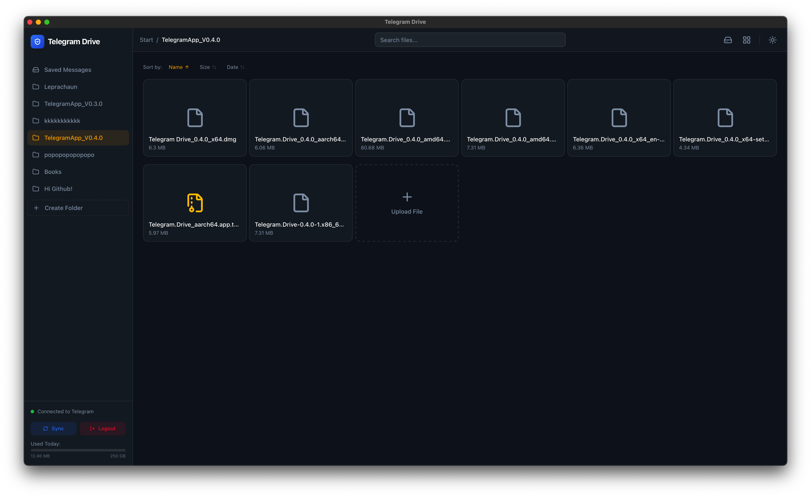
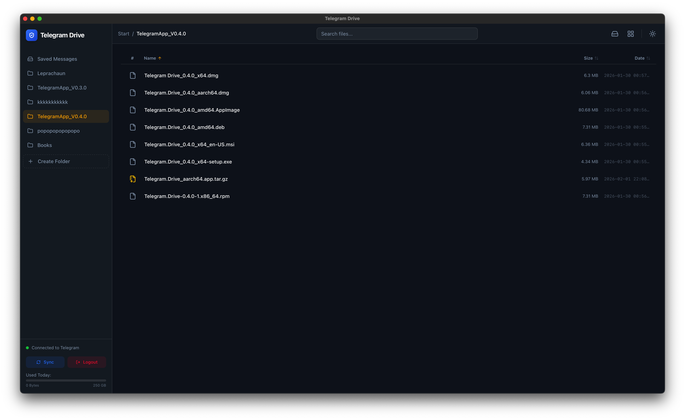
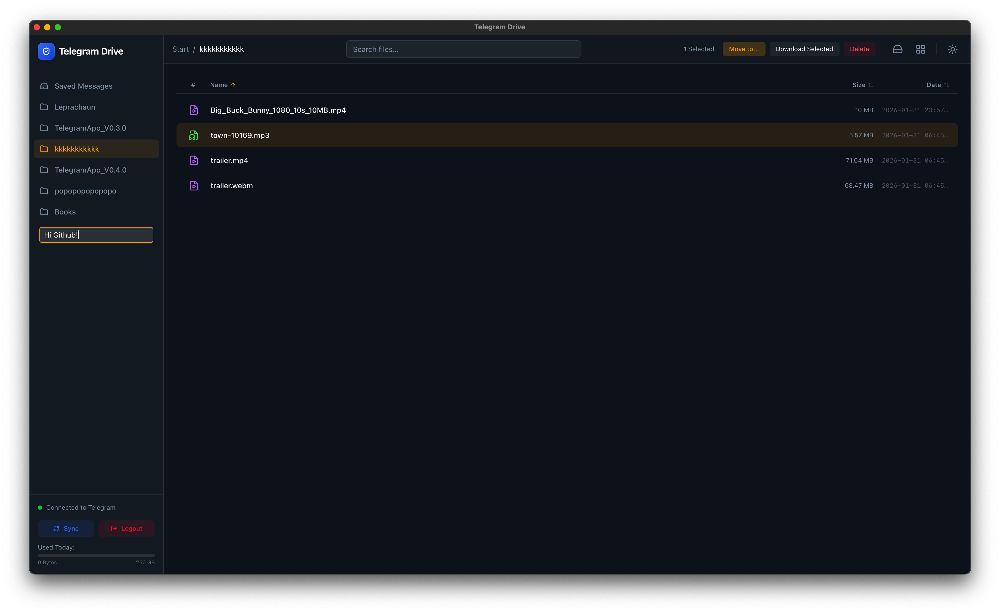
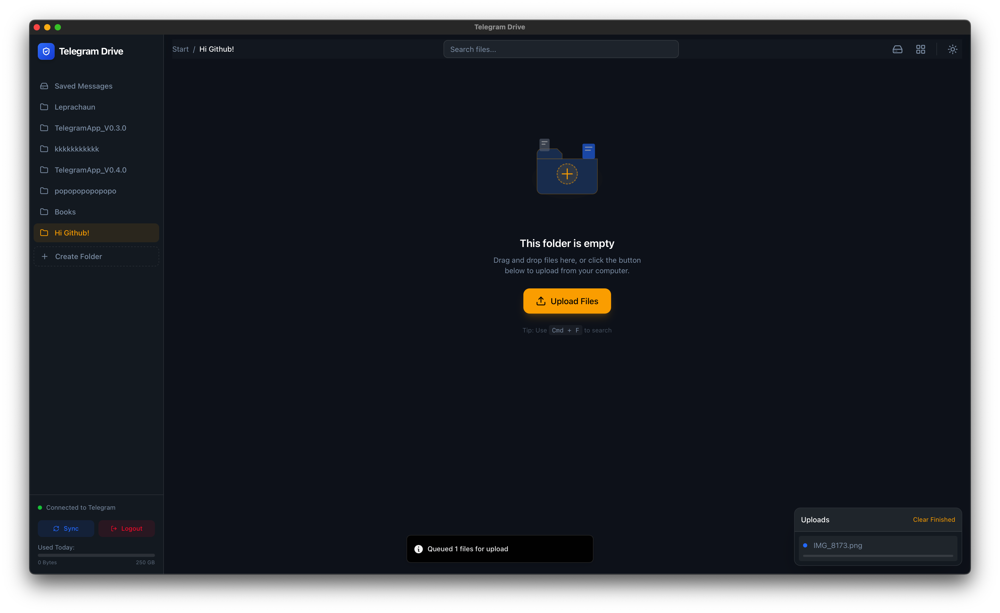

<div align="center">
  
  
  # OmniSync
  
  **Infinite Storage. Zero Friction.**<br>
  *A high-performance, real-time bridge between Google Drive and Telegram's unlimited cloud storage.*

  [](#)
  [](#)
  [](#)
  [](#)

  <p align="center">
    <a href="#-features">✨ Features</a> •
    <a href="#%EF%B8%8F-how-it-works">⚙️ How it Works</a> •
    <a href="#-installation--development">🚀 Installation</a> •
    <a href="#-configuration">🔧 Configuration</a> •
    <a href="#-screenshots">🖼️ Screenshots</a> •
    <a href="#-license">📄 License</a>
  </p>

  <p align="center">
    <a href="https://github.com/8-BitBirdman/OmniSync/releases/latest"><b>⬇️ Download Latest Release</b></a>
  </p>
</div>

---

## 🌌 The Vision

Cloud storage is expensive, restrictive, and fractured. **OmniSync** changes the paradigm by utilizing Telegram's unlimited "Saved Messages" feature as an infinitely scalable backend. 

By acting as a real-time, cross-platform bridge, OmniSync watches your Google Drive and securely funnels your files into Telegram the moment they are created. **No middleman servers, no storage caps, no monthly fees.**

<div align="center">
  
</div>

---

## ✨ Features

- ♾️ **Infinite Telegram Storage:** Upload files of virtually any size (up to Telegram API limits) straight to your own private Telegram channel/Saved Messages.
- ⚡ **Real-Time Google Drive Sync:** Polls the Google Drive Change Feed API every 10 seconds. Drop a file in Google Drive, and watch it instantly appear in OmniSync.
- 🔒 **Zero-Knowledge Architecture:** Everything runs completely locally on your machine via a lightweight Rust backend. Your OAuth tokens and Telegram sessions never leave your device.
- 🎨 **Premium Glassmorphic UI:** A beautifully designed React frontend with dynamic animations, dark mode, and an intuitive file explorer.
- 🚀 **Blazing Fast I/O:** Powered by asynchronous Rust (`tokio`), allowing for multi-threaded, non-blocking file streaming directly from Google servers to Telegram.

---

## ⚙️ How it Works

1. **The Google Connection:** You authorize the app using your own Google Cloud OAuth credentials. OmniSync establishes a secure connection to your Drive.
2. **The Telegram Connection:** You log in to your Telegram account. OmniSync uses `grammers-client` (MTProto) to communicate directly with Telegram's core servers.
3. **The Bridge:** A background `tokio` task listens for changes in Google Drive. When a new file is detected, it is streamed to a temporary cache, uploaded to Telegram, and immediately deleted from your local disk to save space.

---

## 🚀 Installation & Development

### Prerequisites
- [Node.js](https://nodejs.org/) (v18+)
- [Rust](https://www.rust-lang.org/tools/install) (latest stable)
- Telegram App (`api_id` and `api_hash` from [my.telegram.org](https://my.telegram.org))
- Google Cloud Project (for OAuth 2.0 Credentials)

### Setup

1. **Clone the repository:**
   ```bash
   git clone https://github.com/8-BitBirdman/OmniSync.git
   cd OmniSync/app
   ```

2. **Install frontend dependencies:**
   ```bash
   npm install
   ```

3. **Run the development server:**
   ```bash
   npm run tauri dev
   ```

4. **Build for production:**
   ```bash
   npm run tauri build
   ```

---

## 🔧 Configuration

OmniSync needs two sets of credentials: **Telegram** (mandatory) and **Google Drive** (optional, only for the real-time sync bridge).

### Telegram API (`api_id` / `api_hash`)

1. Visit [my.telegram.org](https://my.telegram.org) and log in with your phone number.
2. Click **API development tools**.
3. Fill out the form (any app name/short name works for personal use).
4. Copy the generated **`api_id`** and **`api_hash`**.
5. Paste them into OmniSync's first-run authentication wizard.

> Credentials are stored locally and encrypted via `tauri-plugin-store`. They are never transmitted to any server other than Telegram's official MTProto datacenters.

### Google Drive API (OAuth 2.0)

To enable the real-time Drive → Telegram sync, provide your own Google OAuth credentials:

1. Go to the [Google Cloud Console](https://console.cloud.google.com).
2. Create a new project and enable the **Google Drive API**.
3. Navigate to **APIs & Services → Credentials**.
4. Create an **OAuth Client ID** (Application Type: *Desktop App*).
5. Add `http://127.0.0.1` as an authorized redirect URI.
6. Copy the **Client ID** and **Client Secret** into the OmniSync connection wizard.

---

## 🖼️ Screenshots

<table>
  <tr>
    <td align="center"><br/><sub>Login</sub></td>
    <td align="center"><br/><sub>2FA Code Entry</sub></td>
  </tr>
  <tr>
    <td align="center"><br/><sub>Dashboard</sub></td>
    <td align="center"><br/><sub>Dark Mode Grid</sub></td>
  </tr>
  <tr>
    <td align="center"><br/><sub>List View</sub></td>
    <td align="center"><br/><sub>Folder Creation</sub></td>
  </tr>
  <tr>
    <td align="center"><br/><sub>Image Preview</sub></td>
    <td align="center"><br/><sub>Video Playback</sub></td>
  </tr>
  <tr>
    <td align="center"><br/><sub>Audio Playback</sub></td>
    <td align="center"><br/><sub>Upload Progress</sub></td>
  </tr>
</table>

---

## 🛡️ Security & Privacy

OmniSync is a local-first application. 
- **No Telemetry:** We don't track your usage.
- **Direct API Connections:** The app communicates *only* with `googleapis.com` and Telegram's official MTProto datacenters.
- **Local Token Storage:** OAuth tokens and Telegram session data are encrypted and stored locally via `tauri-plugin-store`.

---

## 🤝 Contributing

Issues, feature requests and PRs are welcome at [github.com/8-BitBirdman/OmniSync](https://github.com/8-BitBirdman/OmniSync).

Before submitting a PR:
- Run `npm run build` from `app/` to confirm the frontend type-checks.
- Run `cargo clippy --all-targets -- -D warnings` from `app/src-tauri/` to confirm Rust lints pass.
- Keep changes focused — one feature/fix per PR.

---

## 📄 License

Released under the [MIT License](LICENSE). © 2026 Andi.

---

<div align="center">
  <i>Built with ❤️ by Andi | 2026</i>
</div>
